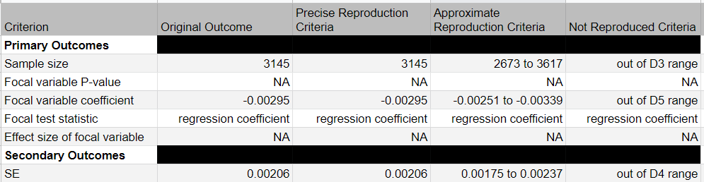
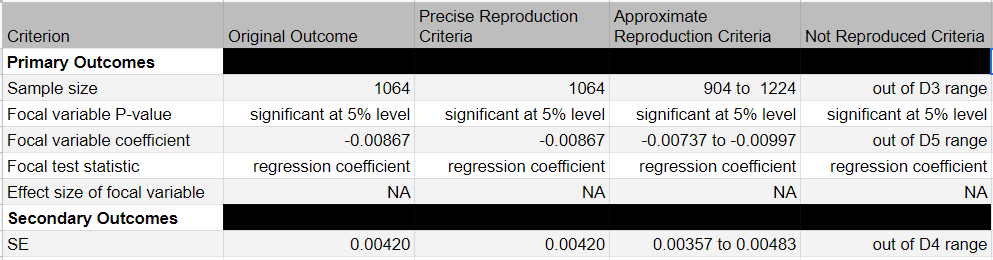
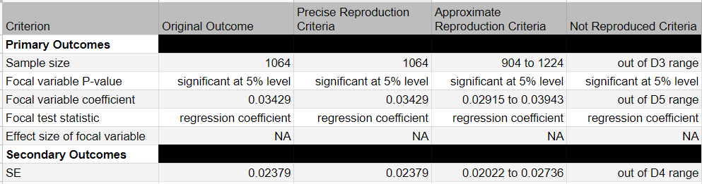
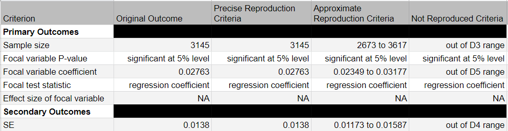
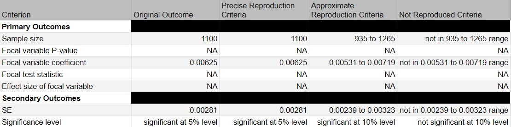

<!-- ----------------------------------------------------- -->

```{r setup, include = FALSE}
set.seed(12345)
options(scipen = 999)
options(max.print = "75")
library(pacman)
p_load(tidyverse, scales, magrittr, margins, report)
```

```{r knit-setup, include = FALSE}
knitr::opts_knit$set(root.dir = rprojroot::find_rstudio_root_file())
knitr::opts_chunk$set(cache = FALSE,
                      prompt = FALSE,
                      tidy = FALSE,
                      comment = NA,
                      message = FALSE,
                      warning = FALSE)
knitr::opts_knit$set(width = 125)
```

<!-- ------------------------------------------------------------ --> 

# General information 

## Preregistration

**Note:** *the registration 7details on the screenshots below have been entered post-analysis.*  

## Data 

```{r include=FALSE}
data <- read_rds("data/data.Rds")
```

The steps used to construct this dataset from the original data are are reproducible using `02_data-management.Rmd` script. The output of these steps together with comments and detail is documented in the `02_data-management.html` file which can be obtained from the mentioned `Rmd` file.  

Prepared dataset consists of `r number(nrow(data), big.mark = ",")` observations. This is only `r percent(nrow(data)/4209, accuracy = 0.1)` of the size of the full sample reported in the paper.  

*Sample size alone already violates any reproducibility criteria and would classify this study as 

## Modelling 

Probit models are fitted with `glm` function from the `stats` package (part of base R).  

Marginal effects were obtained using `margins` package.  

Complete details on the software & computing environment are given in the dedicated section at the bottom of the document.  

## Claims 

*There are 7 bushel-trace claims available from this paper (5 focal).*  

<!-- ------------------------------------------------------------ --> 

# Trace number: 1 / Claim ID: 21v1on

## COS info

Focal: True  

Contains equivalent test from Phase 1 claim: False  

- **Claim 2 (Abstract statement):** However, the effects are different for people in good health than they are for people in bad health. Education does not seem to matter for disease detection when respondents are in good general health, and its effects on disease management vary largely in magnitudes between these groups.  

- **Claim 3 (Finding statement):** We hypothesize that a generally healthy person might not seek medical care and his disease might go undetected, regardless of how educated he is  

- **Claim 4 (Result statement):** Table 2 contains the probit regression results for the determinants of hypertension under-diagnosis… For individuals in good health, the education level does not matter at all… [Table 2, Respondents in good health, Years of Education: Marginal effect = -0.00295, SE = 0.00206].  

- **Statistical evidence:** Table 2, Respondents in good health, Years of Education: Marginal effect = -0.00295, SE = 0.00206  

## Reproduction data

Selecting respondents in good health only.  

```{r}
data_good_health <- data %>% 
  filter(poor_health == 0) %>% 
  select(-poor_health)
```

Dataset consists of `r number(nrow(data_good_health), big.mark = ",")` observations.  

## Reproduction criteria



## Model 

```{r}
trace1 <- glm(underdiagnosed ~ 
                age + age2 + education +
                expenditures_log + time + risk +
                travel_time + sex, 
              family = binomial(link = "probit"), 
              data = data_good_health)

# summary(trace1)
summary(margins(trace1))
```

## Reproduction outcome

Based on the criteria above, the claim **did not** reproduce.  


# Trace number: 2 / Claim ID: ok8kxo

## COS info

Focal: True  

Contains equivalent test from Phase 1 claim: True  

- **Claim 2 (Abstract statement):** In terms of disease detection, more educated respondents have a higher probability of being diagnosed, but only conditional on being in poor general health.  

- **Claim 3 (Finding statement):** Education however, being correlated with earning potential, represents a measure of opportunity cost of being sick and therefore we would expect people with poor general health status to be more likely to seek medical care if they have more education.  

- **Claim 4 (Result statement):** Table 2 contains the probit regression results for the determinants of hypertension under-diagnosis…On the other hand, people who are in poor overall health will feel the need to go see a doctor… [Table 2, Respondents in poor health, Years of Education: Marginal effect = -0.00867, SE = 0.00420, significant at 5% level].  

- **Statistical evidence:** Table 2, Respondents in poor health, Years of Education: Marginal effect = -0.00867, SE = 0.00420, significant at 5% level  
## Reproduction data

Selecting respondents in good health only.  

```{r}
data_poor_health <- data %>% 
  filter(poor_health == 1) %>% 
  select(-poor_health)
```

Dataset consists of `r number(nrow(data_poor_health), big.mark = ",")` observations.  

## Reproduction criteria



## Model 

```{r}
trace2 <- glm(underdiagnosed ~ 
                age + age2 + education +
                expenditures_log + time + risk +
                travel_time + sex, 
              family = binomial(link = "probit"), 
              data = data_poor_health)

# summary(trace2)
summary(margins(trace2))
```

## Reproduction outcome

Based on the criteria above, the claim **did not** reproduce.  


# Trace number: 3 / Claim ID: n3k3qz

## COS info

Focal: True  

Contains equivalent test from Phase 1 claim: False  

- **Claim 2 (Abstract statement):** Time preferences, on the other hand, matter for respondents in good general health, but the effect is not significant for those in bad health. More impatient respondents that are in good health have a higher probability of being under-diagnosed because they are more likely to forgo routine physicals.  

- **Claim 3 (Finding statement):** We therefore expect a positive effect of impatience on the probability of being under-diagnosed for in- dividuals in good health (and also at the aggregate level), and a smaller (possibly zero or negative) effect for individuals in poor health.  

- **Claim 4 (Result statement):** Table 2 contains the probit regression results for the determinants of hypertension under-diagnosis… for respondents in poor health, the time preference parameter and distance to health center do not matter. [Table 2, Respondents in poor health, Time preference: Marginal effect = 0.03429, SE = 0.02379].  

- **Statistical evidence:** Table 2, Respondents in poor health, Time preference: Marginal effect = 0.03429, SE = 0.02379  

## Reproduction data

See Trace 2 above.    

## Reproduction criteria



## Model 

See Trace 2 above.    

## Reproduction outcome

Based on the criteria above, the claim **did not** reproduce.  


# Trace number: 4 / Claim ID: dx1x5w

## COS info

Focal: True  

Contains equivalent test from Phase 1 claim: False  

- **Claim 2 (Abstract statement):** Time preferences, on the other hand, matter for respondents in good general health, but the effect is not significant for those in bad health. More impatient respondents that are in good health have a higher probability of being under-diagnosed because they are more likely to forgo routine physicals.  

- **Claim 3 (Finding statement):** We therefore expect a positive effect of impatience on the probability of being under-diagnosed for individuals in good health (and also at the aggregate level), and a smaller (possibly zero or negative) effect for individuals in poor health.  

- **Claim 4 (Result statement):** Table 2 contains the probit regression results for the determinants of hypertension under-diagnosis…For people in good overall health, the decision to routinely check their health status and potentially discover asymptomatic conditions is simply a time management decision. [Table 2, Respondents in good health, Time preference: Marginal effect = 0.02763, SE = 0.01380, significant at 5% level].  

- **Statistical evidence:** Table 2, Respondents in good health, Time preference: Marginal effect = 0.02763, SE = 0.01380, significant at 5% level  
## Reproduction data

See Trace 1 above.    

## Reproduction criteria



## Model 

See Trace 1 above.    

## Reproduction outcome

Based on the criteria above, the claim **did not** reproduce.  


# Trace number: 5 / Claim ID: 5oxokp

## COS info

Focal: False  

- **Contains equivalent test from Phase 1 claim: False  

- **Claim 2 (Abstract statement):** we find that both education and individual time preferences play important roles.  

- **Claim 3 (Finding statement):** The purpose of our paper is to argue that, when it comes to asymptomatic disease detection, SES and individual time  preference matter, but their effects are different for healthy versus unhealthy people.  

- **Claim 4 (Result statement):** Table 2 contains the probit regression results for the determinants of hypertension under-diagnosis…The level of education, household economic resources, and the access to health care all matter at the aggregate level. [Table 2, Aggregate sample, Years of Education: Marginal effect = -0.00333, SE = 0.00188, significant at 10% level].  

- **Statistical evidence:** Table 2, Aggregate sample, Years of Education: Marginal effect = -0.00333, SE = 0.00188, significant at 10% level  

## Reproduction data

Using full prepared dataset consisting of `r number(nrow(data), big.mark = ",")` observations.  

## Reproduction criteria

NA  

## Model 

```{r}
trace5 <- glm(underdiagnosed ~ 
                age + age2 + education +
                expenditures_log + time + risk +
                travel_time + sex, 
              family = binomial(link = "probit"), 
              data = data)

# summary(trace5)
summary(margins(trace5))
```

## Reproduction outcome

NA  


# Trace number: 6 / Claim ID: ywjwq1

## COS info

Focal: False  

Contains equivalent test from Phase 1 claim: False  

- **Claim 2 (Abstract statement):** we find that both education and individual time preferences play important roles.  

- **Claim 3 (Finding statement):** The purpose of our paper is to argue that, when it comes to asymptomatic disease detection, SES and individual time | preference matter, but their effects are different for healthy versus unhealthy people.  

- **Claim 4 (Result statement):** Table 2 contains the probit regression results for the determinants of hypertension under-diagnosis…We also confirm that individual time preferences are important for disease detection in the same way that they are important for overall health measures… [Table 2, Aggregate sample, Time Preference: Marginal effect = 0.03457, SE = 0.01214, significant at 1% level].  

- **Statistical evidence:** Table 2, Aggregate sample, Time Preference: Marginal effect = 0.03457, SE = 0.01214, significant at 1% level  

## Reproduction data

See trace 5.  

## Reproduction criteria

NA  

## Model 

See trace 5.  

## Reproduction outcome

NA  


# Trace number: 7 / Claim ID: 8rlrky

## COS info

Focal: True  

Contains equivalent test from Phase 1 claim: False  

- **Claim 2 (Abstract statement):** However, the effects are different for people in good health than they are for people in bad health. Education does not seem to matter for disease detection when respondents are in good general health, and its effects on disease management vary largely in magnitudes between these groups.  

- **Claim 3 (Finding statement):** We also hypothesize similarly different effects of education and time preferences on disease management, once patients are diagnosed.  

- **Claim 4 (Result statement):** As predicted, we do observe different effects, both in magnitude and significance for generally healthy and generally unhealthy respondents. The level of education matters for all respondents, but with different magnitudes. More specifically, for individuals in poorer general health, education has a larger impact than for individuals in good health who possess no obvious impairing symptoms. [Table 4, Respondents in good health, Years of Education: Marginal effect = 0.00625, SE = 0.00281, significant at 5% level; Respondents in poor health, Years of Education: Marginal effect = 0.01407, SE = 0.00499, significant at 1% level]  

- **Statistical evidence:** Table 4, Respondents in good health, Years of Education: Marginal effect = 0.00625, SE = 0.00281, significant at 5% level; Respondents in poor health, Years of Education: Marginal effect = 0.01407, SE = 0.00499, significant at 1% level  

## Reproduction data

Selecting diagnosed respondents in good health only.  

```{r}
data_diag <- data %>% 
  filter(underdiagnosed == 0) %>% 
  select(-underdiagnosed) %>% 
  filter(poor_health == 0) %>% 
  select(-poor_health)
```

Dataset consists of `r number(nrow(data_diag), big.mark = ",")` observations.  

## Reproduction criteria



## Model 

```{r}
trace7 <- glm(bp_month2 ~ 
                age + age2 + education +
                expenditures_log + time + risk +
                travel_time + sex, 
              family = binomial(link = "probit"), 
              data = data_diag)

# summary(trace7)
summary(margins(trace7))
```

## Reproduction outcome

Based on the criteria above, the claim **did not** reproduce.  


<!-- ----------------------------------------------------- -->

# Final remarks

All in all I would consider this paper to be pretty much impossible to be faithfully reproduced. To start with - the paper does not even report which software was used in the analyses. More worryingly, the amount of undocumented and undescribed steps taken in the data preparation itself could lead to virtually infinite amount of slightly different analyses that could be conducted.  

The preparation of 'simple' years of education variable - definitions, criteria, handling of missings is already extremely difficult with lack of code and laconic description provided in the paper. More elaborate variables such as time preference construct for instance present possibilities to again create multiple versions of the same dataset - which risk was taken into account - A or B? maybe both? what happened to missing information?  

I cannot question validity of the paper itself. But I think it's safe to assume that without any additional information from the authors of the study - either in a descriptive from properly defining the steps taken or in the form of computer code, this study is impossible to be reproduced.  

<!-- ----------------------------------------------------- -->

# Computing Environment

```{r echo=FALSE, results='asis'}
report(sessionInfo())
```

